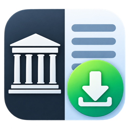
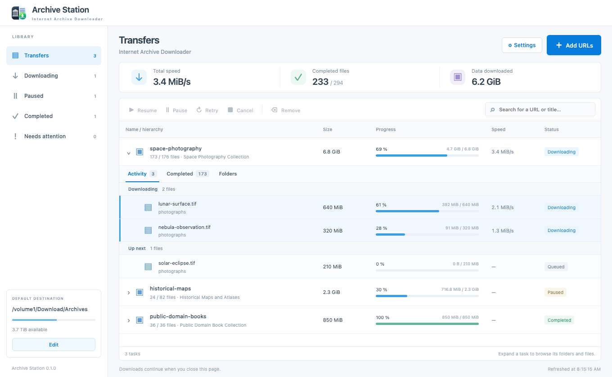
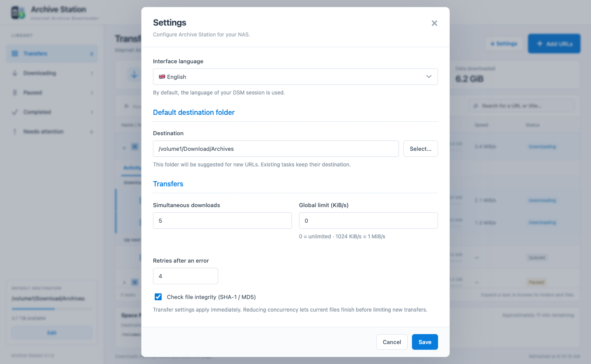
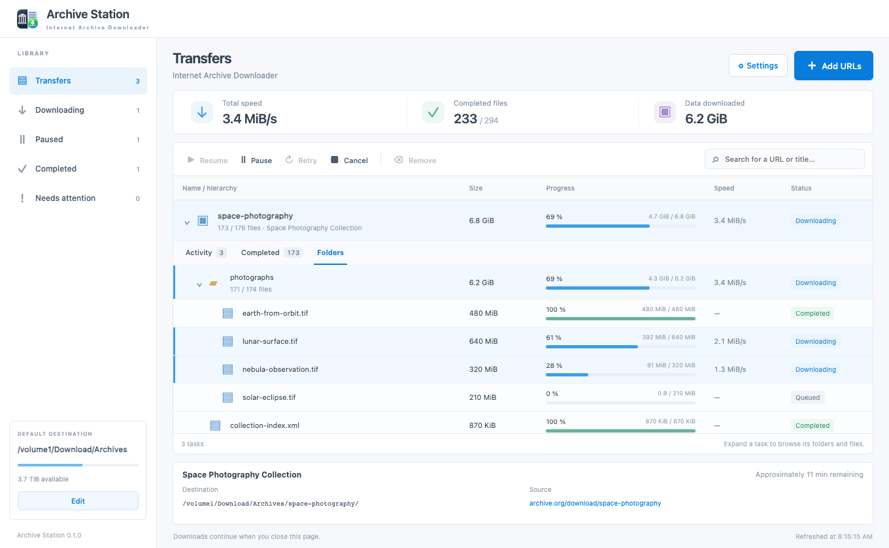

<p align="center">
  
</p>

<h1 align="center">Archive Station</h1>
<p align="center"><strong>Internet Archive Downloader for Synology DSM</strong></p>
<p align="center">One URL. One folder. Every file in its place.</p>

Archive Station downloads the public files of Internet Archive items directly to your NAS. Paste an item URL, review its contents, and follow live transfers, upcoming files and an expandable folder tree — inside a native DSM desktop window.

**No Docker. No extra sign-in. Downloads keep running when you close the window.**



*Screenshots show the actual application with demonstration data, not a live download.*

## What you can do

- **Add multiple URLs** — accept `/details/` and `/download/` links, preview file counts and sizes, and create one independent task per item.
- **See the whole hierarchy** — item → folders → files, with progress, transfer speeds, status filters and search.
- **Control transfers** — pause, resume, cancel, retry failed files, or remove a task while preserving its downloads.
- **See what is happening now** — Activity shows live transfers and the next ten files across every subfolder. Completed files have their own view; the folder tree remains available.
- **Tune without restarting** — change the global speed limit or run 1–8 parallel downloads, including for tasks already in progress.
- **Choose your destination** — browse NAS folders, distinguish read/write, read-only and inaccessible locations, and create subfolders.
- **Resume safely** — keep partial files separate, resume supported HTTP transfers, and verify available SHA-1/MD5 checksums before publishing final files.
- **Keep a download record** — an automatically updated plain-text report records each task’s source, dates, sizes, duration and results.
- **Use your language** — 27 bundled languages, following the DSM session by default, with a language and flag selector in Settings.

## Compatibility

| | Current package |
|---|---|
| Platform | Synology DSM 7, **x86_64** |
| Tested NAS | DS918+, DSM 7.1.1 |
| Runtime | Bundled Python 3.12 and Waitress; no separate Python package required |
| Access | Existing **DSM administrator session**, on the same DSM address |
| Download source | Public files belonging to an Internet Archive item |

ARM packages are not available yet. Other DSM versions and models need community testing. Archive Station does not recursively crawl collections, authenticate to restricted Archive.org files, or extract ZIP archives.

## Install

1. Build the package with `make build` (see below). Packages intended for distribution belong in [GitHub Releases](https://github.com/jbdemonte/synology-archive-downloader/releases).
2. Open **Package Center → Manual Install** and select `dist/ArchiveStation-0.1.0-11-x86_64.spk`.
3. Launch **Archive Station** from the DSM main menu.
4. Open **Settings** to choose a destination and transfer limits.

The package creates an `ArchiveStation` shared folder as the initial destination. To use an existing share such as `Download`:

1. In DSM, open **Control Panel → Shared Folder → Download → Edit → Permissions**.
2. Select **System internal user** and grant **Read/Write** to `ArchiveStation`.
3. In Archive Station, choose the share or one of its subfolders.

The folder picker marks **read/write in green**, **read-only in blue**, and **insufficient access in orange**. Open a writable folder and use **New folder → Create → Choose this folder** to create a destination. Reopen the picker after changing DSM permissions.



## Add your first archive

Paste up to 20 item URLs, one per line, then select **Analyze URLs**. The form shows the current URL being analyzed and prevents edits until analysis finishes. You can cancel it at any time.

Both forms refer to the same item:

```text
https://archive.org/details/<item-identifier>
https://archive.org/download/<item-identifier>
```

Review the file count and size, optionally choose **Original files only**, or apply a filename pattern such as `*.zip`. Choose **Add paused** if you want to start later.

```text
Your destination/
├── first-item-identifier/
│   ├── images/
│   │   └── photo.jpg
│   ├── readme.txt
│   └── ArchiveStation-report-<task-id>.txt
└── another-item-identifier/
    └── ...
```

The item identifier determines its directory name; nested paths from Archive.org are preserved. Changing the default destination affects new tasks. Existing tasks keep their original destination.

## Follow large archives

The first running task opens automatically. Its **Activity** view shows active transfers across all subfolders, then a preview of upcoming files in worker queue order. Completed files move into **Completed**. **Folders** keeps the full directory hierarchy, and **Needs attention** appears when files fail. Activity refreshes without pagination; only historical lists and full directory browsing are paginated.



## Interruptions, settings and reports

**Files only appear under their final names after successful transfer and verification.** Incomplete data lives in `<destination>/.archive-station-parts/<task-id>/`. Do not delete that directory if you want to resume partial downloads.

An active task resumes automatically after a package restart or upgrade. Paused and cancelled tasks remain stopped. HTTP `Range` resumes from the actual partial file size; if the remote server ignores it, that file restarts cleanly. A matching complete file is reused. A conflicting existing file is never overwritten.

Increasing parallel downloads starts additional transfers without restarting the task. Decreasing the limit lets current files finish, then restricts new transfers. The global bandwidth limit is also applied while transfers run.

Each item directory contains `ArchiveStation-report-<task-id>.txt`, refreshed approximately every 15 seconds and on clean shutdown. Open it in any text editor: it uses clear sections, readable sizes and dates, and a duration in days/hours/minutes/seconds. Reports use French when the interface language is French, and English otherwise. In automatic mode, the resolved language of the last opened DSM session is remembered for background reports (English fallback before first opening). Previous JSON reports generated by Archive Station are replaced automatically.

The report includes the source and canonical download URLs, creation/update/completion times, retained bytes, completed bytes, file counts, errors and selection options. **Duration is elapsed wall time from task creation, including pauses and downtime.** Byte counts represent retained data, not cumulative network traffic. Older tasks receive a report after upgrading; their original completion time may be unavailable.

Removing a task preserves complete and partial files. Re-adding its URL reuses verified complete files, but the old task’s partial files are not reused automatically.

## Languages

English, Français, Español, Português, Português (Brasil), Deutsch, Italiano, Polski, Nederlands, Türkçe, Bahasa Indonesia, Čeština, Română, Magyar, Svenska, Dansk, Norsk bokmål, Suomi, 日本語, 한국어, 简体中文, 繁體中文, Русский, ไทย, Українська, Ελληνικά and Tiếng Việt.

**Settings → Interface language** lets you override the automatic DSM language. The choice is saved on the NAS. Standalone development follows the browser language when set to Automatic. Catalogs are bundled and work offline; see [the translation guide](docs/TRANSLATIONS.md) to help improve them.

## Build and develop

Build requirements: **Python 3.12+**, `make`, and network access for the first dependency download. macOS and Linux can build the package without executing the bundled Linux runtime.

```sh
make build                 # Build the x86_64 .spk and SHA-256 checksum
make build VERSION=0.1.0-11 # Override the package version
make deps                  # Create the virtual environment and install Waitress
make run                   # Start locally at http://127.0.0.1:8274
```

Python and Waitress artifacts are pinned and checksum-verified in `packaging/synology/runtime-lock.json`. Downloads are cached in `build/cache/`; subsequent builds work offline. Third-party licenses are included in the package.

Standalone mode writes its initial password to `data/initial-password.txt`. That password is only for local development; the DSM package uses DSM authentication. Local state lives in `data/` and downloads in `downloads/`.

```sh
make dev-deps   # Install development tools and Chromium
make check      # Backend tests, catalog validation, Ruff and Prettier
make test-ui    # Isolated browser tests; no external downloads
make screenshots # Regenerate README screenshots from demo fixtures
make format
```

UI tests use port 8275 temporarily. Set `CHROMIUM_PATH` to an existing Chromium executable if necessary. Tests cover interrupted transfers, process termination, resumption, changing concurrency, old database migration, reports, permissions, DSM integration and all supported interface languages.

```text
src/archive_station/  Download engine, API, SQLite, settings and static UI
packaging/synology/   DSM lifecycle scripts, launcher, gateway and runtime licenses
scripts/             Build tooling, browser tests and screenshots
tests/              Deterministic backend tests and isolated UI fixtures
```

## Troubleshooting and contributing

- **A share is missing or orange:** check the package system user’s DSM permissions, then reopen the picker.
- **A file needs authorization:** restricted Archive.org files are not supported. Public files continue independently.
- **Downloads stop on one file:** inspect its error in the tree, correct the cause and select Retry.
- **The session expires:** sign back into DSM and reopen Archive Station.
- **The UI looks outdated after upgrading:** close and reopen the application, or refresh the DSM desktop.

DSM state and rotating logs live in `/var/packages/ArchiveStation/var/` (`archive-station.sqlite3`, `settings.json`, `archive-station.log`). Stop the package before copying its state directory, or use SQLite’s backup API for a live database backup. Package upgrades preserve task state and downloaded files.

Bug reports should include the package version, DSM version, NAS model, reproducible steps and relevant log excerpts with private data removed. Pull requests should explain the resulting behavior and tests; include screenshots for visual changes. Python follows Ruff; HTML, CSS and JavaScript use Prettier. See [architecture](docs/ARCHITECTURE.md), [DSM packaging](docs/SYNOLOGY.md), and [translations](docs/TRANSLATIONS.md).

Licensed under [MIT](LICENSE). Independent of Synology and Internet Archive. No archive content is bundled with the application.
