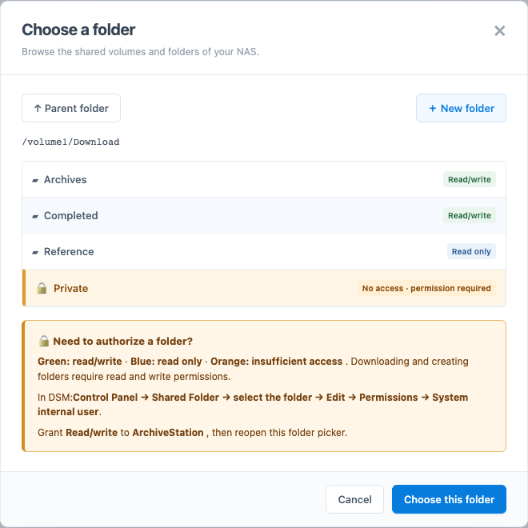
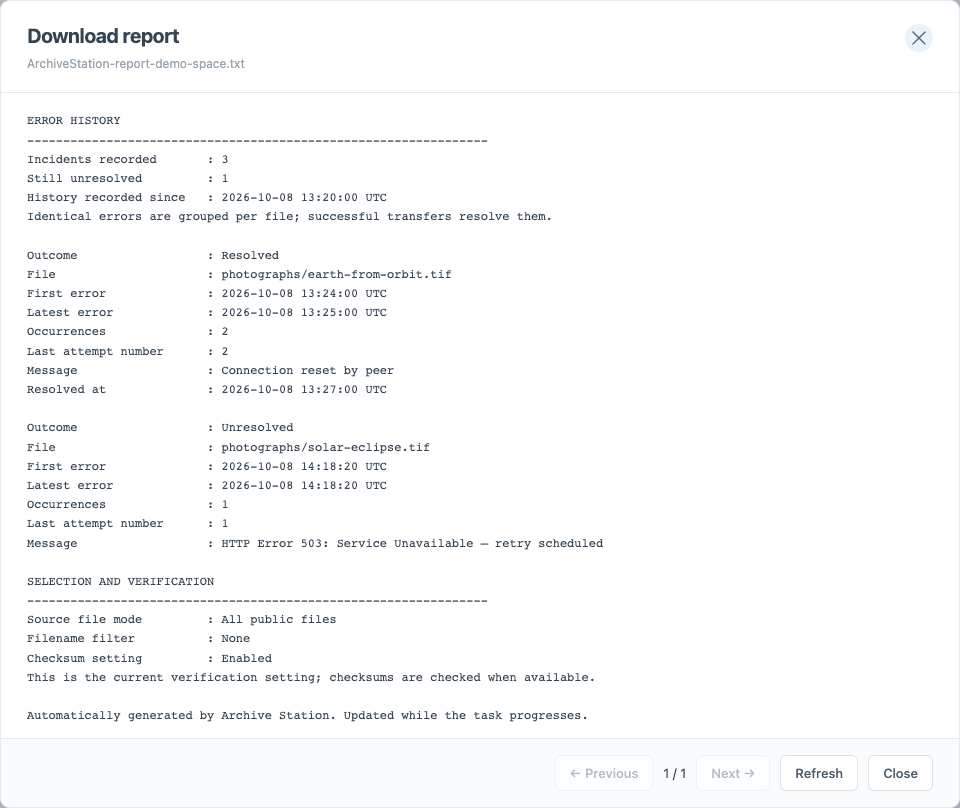
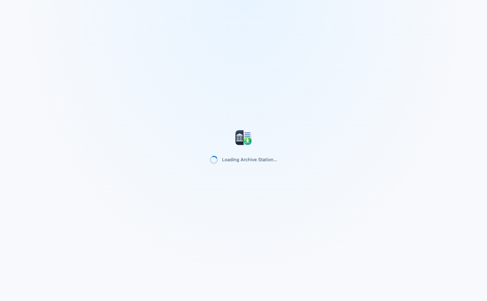
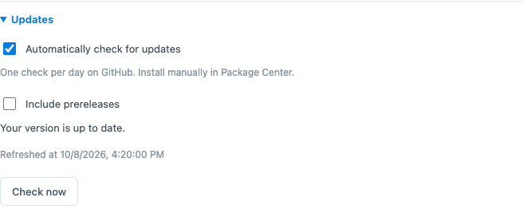

<p align="center">
  
</p>

<h1 align="center">Archive Station</h1>
<p align="center"><strong>Internet Archive Downloader for Synology DSM</strong></p>
<p align="center">One URL. One folder. Every file in its place.</p>

Archive Station downloads the public files of Internet Archive items directly to your NAS. Paste an item URL, review its contents, and follow live transfers, upcoming files and an expandable folder tree — inside a native DSM desktop window.

**No Docker. No extra sign-in. Downloads keep running when you close the window.**


*Screenshots show the current embedded DSM application view with isolated demonstration data.*

## What you can do

- **One folder per URL** — add multiple `/details/` or `/download/` links and select files, folders or filename patterns before starting.
- **Follow large archives** — live transfers and upcoming files appear first; completed files and the folder tree have separate views.
- **Control the queue** — pause, resume, cancel or retry from the toolbar; use each archive's **⋯** menu for priority, maintenance and reports.
- **Plan transfers** — choose weekly time slots, alternate speed limits, live concurrency and a free-space reserve.
- **See progress** — per-file gauges, remaining-time estimates, downloaded/total sizes and a persistent throughput graph with 1, 6, 12 or 24-hour views.
- **Maintain an archive** — verify and repair files, review source updates, and select additions or changed files to retrieve.
- **Work inside DSM** — browse writable folders, open destinations in File Station, and receive desktop notifications. Each task also links to its original Archive.org page.
- **Resume safely** — partial files stay separate; transfers resume after restarts and upgrades, with checksum verification where available.
- **Keep a readable record** — each archive gets a plain-text report in English or French with persistent error history, also readable inside the app.
- **Use your language** — 27 bundled interface languages, automatic DSM language detection and an override in Settings.
- **Find new versions** — optional daily GitHub release checks, a manual check and a link when an update is available.

See the [usage guide](docs/USAGE.md) for scheduling, priorities, disk reserves, repair and refresh behavior.

## Compatibility

| | Current package |
|---|---|
| Platform | Synology DSM 7, **x86_64** |
| Tested NAS | DS918+, DSM 7.1.1 |
| Runtime | Bundled Python 3.12 and Waitress; no separate Python package required |
| Access | Existing **DSM administrator session**, on the same DSM address |
| Download source | Public files belonging to an Internet Archive item |

ARM packages are not available yet. Other DSM versions and models need community testing. Archive Station does not recursively crawl collections, authenticate to restricted Archive.org files, or extract ZIP archives.

## Trust boundary

DSM access is restricted to administrator sessions. The internal API listens on loopback and trusts a gateway marker header; local NAS users and services can forge that marker. This version therefore assumes trusted local accounts and workloads. It does not provide isolation from untrusted users or containers sharing the NAS network stack.

## Install

1. Download the `.spk` from [GitHub Releases](https://github.com/jbdemonte/synology-archive-downloader/releases), or build it with `make build` (see below).
2. Open **Package Center → Manual Install** and select `ArchiveStation-0.2.0-9-x86_64.spk` (local builds place it in `dist/`).
3. Launch **Archive Station** from the DSM main menu.
4. Open **Settings** to choose a destination and transfer limits.

The package creates an `ArchiveStation` shared folder as the initial destination. To use an existing share such as `Download`:

1. In DSM, open **Control Panel → Shared Folder → Download → Edit → Permissions**.
2. Select **System internal user** and grant **Read/Write** to `ArchiveStation`.
3. In Archive Station, choose the share or one of its subfolders.

The folder picker marks **read/write in green**, **read-only in blue**, and **insufficient access in orange**. Open a writable folder and use **New folder → Create → Choose this folder** to create a destination. Reopen the picker after changing DSM permissions.

<details>
<summary>Choose a destination and check folder permissions</summary>



</details>

<details>
<summary>See language, destination and transfer settings</summary>


</details>

## Upgrade while downloads are running

1. Download the newer `.spk` and its `.spk.sha256` file from [GitHub Releases](https://github.com/jbdemonte/synology-archive-downloader/releases). To check the package download, run this command from their directory:

   ```sh
   shasum -a 256 -c ArchiveStation-0.2.0-9-x86_64.spk.sha256
   ```

   On Linux, use `sha256sum -c` instead.

2. In DSM, use **Package Center → Manual Install** to install the newer package over the existing installation. DSM briefly stops and restarts Archive Station.
3. Close and reopen the application, then check that progress continues.

**An in-place upgrade preserves the queue, settings, completed files, partial downloads and error history.** Running tasks resume automatically; paused and cancelled tasks remain stopped. Downloads retain their original destination. The throughput graph is retained across restarts from version 0.2.0-8 onward; the remaining-time estimate rebuilds its recent measurements.

Incomplete files stay in `.archive-station-parts` and resume from their actual size on disk. They only appear under their final names after transfer and the applicable integrity checks succeed. Keep **Check file integrity (SHA-1 / MD5)** enabled to compare files against the hashes supplied by Archive.org. If the server cannot resume a partial file, Archive Station downloads that file again cleanly. See [reliable downloads](#reliable-downloads-and-live-settings) for verification limits and conflict handling.

The **0.2.0-6 → 0.2.0-7** upgrade was verified on a DS918+ running DSM 7.1.1 with five active transfers: partial files were retained, sampled completed files kept identical hashes, settings were preserved and progress resumed. Automated tests also cover forced process termination and recovery.

For a manual pre-upgrade backup of the queue and configuration, stop the package and copy `/var/packages/ArchiveStation/var/`, then restart it. Downloaded files live separately in your chosen destination. A live database backup requires SQLite's backup API rather than copying an active database file.

## Add your first archive

Paste up to 20 item URLs, one per line, then select **Analyze URLs**. The form shows the current URL being analyzed and prevents edits until analysis finishes. You can cancel it at any time.

Both forms refer to the same item:

```text
https://archive.org/details/<item-identifier>
https://archive.org/download/<item-identifier>
```

Review the file count and size, optionally choose **Original files only**, or apply a filename pattern such as `*.zip`. Use **Choose files…** to select individual files or entire folders. Choose **Add paused** if you want to start later.

```text
Your destination/
├── first-item-identifier/
│   ├── images/
│   │   └── photo.jpg
│   ├── readme.txt
│   └── ArchiveStation-report-<task-id>.txt
└── another-item-identifier/
    └── ...
```

The item identifier determines its directory name; nested paths from Archive.org are preserved. The default destination is locked while tasks are running or queued. Pause all downloads and wait for active transfers to stop before changing it, or wait until they finish. This changes the destination for new tasks only; existing tasks keep their original directory. Transfer limits and language remain editable during downloads.

## Follow large archives

The first running task expands automatically. **Activity** shows live transfers across all subfolders, followed by upcoming files in queue order. Completed files move into **Completed**; **Folders** keeps the full directory hierarchy. **Needs attention** appears when files fail. A disk-space hold or failed files are also noted under the archive's status.

Activity refreshes without pagination; only completed/error lists and full directory browsing are paginated.

<details>
<summary>Browse the folder hierarchy</summary>


</details>

## Control each archive

- **Toolbar:** select an archive row, or check several, to enable Pause, Resume and other actions. A single visible archive is selected automatically. **Global actions** controls the whole queue.
- **⋯ menu:** open the menu beside an archive's name to see its destination, open it in File Station, change priority or queue order, refresh the file list, verify and complete files, or read its report. These actions apply to that archive, independently of checked rows.
- **Row shortcuts:** the document icon opens the report; the external-link icon opens the item's `archive.org/details/…` page in a browser tab. Downloads keep running in DSM.


The menu stays open during progress updates. Use Enter to open it, arrow keys to move between actions, and Escape to close it. It scrolls when the DSM window is too short to show every action. Pause an archive and wait for its active transfers to stop before starting verification or applying a file-list update.

## Transfer history and time remaining

Expand **Transfer history** and choose **1 h, 6 h, 12 h or 24 h** in **Period**. Your choice is remembered in that browser. Each view has 120 points: averages over **30 seconds, 3 minutes, 6 minutes or 12 minutes**, respectively. Hover for the rate and time interval; longer views also show the date and time. The graph updates as each 30-second sample completes.

The NAS collects measurements even while the application window is closed and retains up to **24 hours** on disk. Checkpoints run every 30 seconds when traffic has changed, with a final checkpoint on orderly shutdown. Normal package restarts and upgrades retain the saved graph; a forced termination can lose the most recent unsaved samples, typically up to 30 seconds. This affects the graph only, not the retained download files. History already lost by older versions cannot be reconstructed.


The data summary shows downloaded bytes / total known size. A **+** means some file sizes are unknown. Remaining time uses actual bytes received across an archive’s concurrent transfers, with a **five-minute rolling average** and **30 seconds of initial observation**. Hover over the estimate to see the average rate. **≥** marks a minimum estimate when sizes are unknown. After a minute without data, the duration is replaced by “Waiting for data”. Pausing or restarting the package resets the observation window; retained partial files are not counted as new traffic.

## Reliable downloads and live settings

**Files only appear under their final names after successful transfer and verification.** Incomplete data lives in `<destination>/.archive-station-parts/<task-id>/`. Do not delete that directory if you want to resume partial downloads.

An active task resumes automatically after a package restart or upgrade. Paused and cancelled tasks remain stopped. HTTP `Range` resumes from the actual partial file size; if the remote server ignores it, that file restarts cleanly. A matching complete file is reused. Normal transfers refuse conflicting existing files. An explicit repair or metadata update backs up a replaced file before downloading its replacement.

With checksum verification enabled, Archive Station reads the downloaded file from disk, computes its SHA-1 (or MD5 when only MD5 is available), and compares it with the value supplied by Archive.org. A mismatch triggers another attempt within the configured retry limit. When no checksum is supplied, verification is limited to the expected size when available.

Increasing parallel downloads starts additional transfers without restarting the task. Decreasing the limit lets current files finish, then restricts new transfers. The global bandwidth limit is also applied while transfers run.

Removing a task preserves complete and partial files. Re-adding its URL reuses verified complete files, but the old task’s partial files are not reused automatically.

## Reports and error history

Click the **document icon** on a task, or **Read report** in its **⋯** menu, to open an up-to-date plain-text report inside Archive Station. Use **Refresh** to reload it; long reports have page controls.

The icon turns **amber** when incidents have been recorded, including incidents that were later resolved. The report lists the affected file, first and last occurrence, diagnostic message, occurrence count, last attempt number and resolution date. Identical errors are grouped per file. Retries, successful completion and service restarts preserve this history; low-disk-space pauses are recorded too.



Each item directory also contains `ArchiveStation-report-<task-id>.txt`, checked approximately every 15 seconds and on clean shutdown, and rewritten only when its state, counters or report settings change. This file contains the complete report and can be opened in any text editor. It includes the source URLs, dates, file counts, retained bytes, selection settings and error history. **Duration includes pauses and downtime; byte counts represent retained data, not cumulative network traffic.**

**Report translations currently cover English and French.** French interface selection produces a French report; other interface languages produce an English report. Automatic mode remembers the last resolved DSM interface language for background reports, with the same fallback. Changing the language updates the disk report at the next check; select **Refresh** to reload an already open reader. Technical error messages are preserved as recorded.

Incident history begins when this feature is installed: existing errors are imported when available, but incidents already cleared by older versions cannot be recovered.

## Startup and connection status

On opening, a loading screen remains visible until the DSM session, settings and task list are ready. If the service cannot be reached, a message and **Retry** button appear. An empty download list is only displayed once the initial request succeeds. An expired DSM session can be retried in the same window after signing in again. Background refreshes stop while the browser tab is hidden and resume when it becomes visible.

<details>
<summary>See the startup loading screen</summary>



</details>

## Languages

English, Français, Español, Português, Português (Brasil), Deutsch, Italiano, Polski, Nederlands, Türkçe, Bahasa Indonesia, Čeština, Română, Magyar, Svenska, Dansk, Norsk bokmål, Suomi, 日本語, 한국어, 简体中文, 繁體中文, Русский, ไทย, Українська, Ελληνικά and Tiếng Việt.

**Settings → Interface language** lets you override the automatic DSM language. The choice is saved on the NAS. Standalone development follows the browser language when set to Automatic. Catalogs are bundled and work offline; see [the translation guide](docs/TRANSLATIONS.md) to help improve them.

Language names are sorted alphabetically using the current interface locale; Automatic stays first. The 27-language support applies to the interface; [download reports](#reports-and-error-history) currently support English and French.

## Update notifications

Open **Settings → Updates** and enable **Automatically check for updates** for one check per day, even when the application window is closed. Automatic checks are **off by default**. **Check now** also works with automatic checks disabled; save any changed update options first. Enable **Include prereleases** to receive community previews as well as stable releases.

A newer compatible package appears as a link below the page title and in Settings. Follow it to GitHub and use the [in-place upgrade procedure](#upgrade-while-downloads-are-running). Installation is manual; task state and partial downloads are retained.

Checks use GitHub's public API without credentials or download information. Only published releases with a matching x86_64 package are considered; drafts are excluded. A private repository or a channel without a published package reports **No compatible public release**. Network errors report a failed check, rather than claiming the application is up to date. Checks run independently of download workers and are limited to one manual request per minute.

<details>
<summary>See update preferences and the manual check</summary>



</details>

## Build and develop

Build requirements: **Python 3.12+**, `make`, and network access for the first dependency download. macOS and Linux can build the package without executing the bundled Linux runtime.

```sh
make build                 # Build the x86_64 .spk and SHA-256 checksum
make release               # Validate and prepare all GitHub release assets
make build VERSION=0.2.0-9  # Override the package version
make deps                  # Create the virtual environment and install Waitress
make run                   # Start locally at http://127.0.0.1:8274
```

Python and Waitress artifacts are pinned and checksum-verified in `packaging/synology/runtime-lock.json`. Downloads are cached in `build/cache/`; subsequent builds work offline. Third-party licenses are included in the package.

`make release` requires a clean Git checkout and development dependencies. See [prepare a community release](#prepare-a-community-release) below for the generated assets and publication steps.

Standalone mode writes its initial password to `data/initial-password.txt`. That password is only for local development; the DSM package uses DSM authentication. Local state lives in `data/` and downloads in `downloads/`.

```sh
make dev-deps    # Install development tools and Chromium
make check       # Backend tests, catalog validation, Ruff and Prettier
make test-ui     # Isolated browser tests; no external downloads
make screenshots # Regenerate README screenshots from demo fixtures
make format
```

UI tests use port 8275 temporarily. Set `CHROMIUM_PATH` to an existing Chromium executable if necessary. Tests cover interrupted transfers, process termination, resumption, changing concurrency, old database migration, error history, the report reader, startup recovery, source links, task menus, permissions, DSM integration and all supported interface languages.

`make screenshots` regenerates the activity, task menu, folder tree, destination picker, settings, updates, history, report and startup images in `docs/images/`. It loads the embedded interface with simulated gateway responses and uses the application's own report formatter. It does not connect to a NAS, Archive.org or GitHub.

```text
src/archive_station/  Download engine, API, SQLite, settings and static UI
packaging/synology/   DSM lifecycle scripts, launcher, gateway and runtime licenses
scripts/             Build tooling, browser tests and screenshots
tests/               Deterministic backend tests and isolated UI fixtures
```

## Prepare a community release

After installing development dependencies, update the package version and `docs/releases/<version>.md`, regenerate screenshots if the interface changed, and commit the sources. Then run:

```sh
make release
```

The command exports the committed tree, runs backend tests, formatting checks and browser tests, builds the `.spk`, and validates its contents. A successful run creates `dist/releases/<version>/` with:

- The installable `.spk` and its SHA-256 checksum.
- A source archive containing the same committed code, README and screenshots.
- `RELEASE_NOTES.md`, `INSTALL.md` and `BUILD-INFO.txt` identifying the commit and completed checks.
- `SHA256SUMS` for the bundle and `PUBLISH.md` with the exact tag and GitHub draft-release commands.

The source archive contains committed files only; ignored local files, downloads and the private development how-to are excluded. The command prepares local artifacts; publishing is a separate step.

Follow `PUBLISH.md` to push the source and tag and create a **draft release** with its attachments. Review the draft, make the repository public when ready, then select **Publish release**. Making the repository public alone does not publish a draft. Keep the first release marked **Pre-release** while gathering feedback on other NAS models; users must enable **Include prereleases** to discover it through the in-app checker.

GitHub Releases supports direct `.spk` distribution for manual DSM installation. SynoCommunity inclusion is a separate contribution to `SynoCommunity/spksrc`, requiring a package recipe and maintainer review; uploading a GitHub release does not add the application to their catalog. See [release and community distribution](docs/RELEASING.md) for the full workflow and upstream references.

## Troubleshooting and contributing

- **A share is missing or orange:** check the package system user’s DSM permissions, then reopen the picker.
- **A file needs authorization:** restricted Archive.org files are not supported. Public files continue independently.
- **Downloads stop on one file:** open its task report or the **Needs attention** view, correct the cause and select Retry.
- **The startup screen reports a connection error:** check that the package is running, then select Retry.
- **The session expires:** sign back into DSM and reopen Archive Station.
- **The UI looks outdated after upgrading:** close and reopen the application, or refresh the DSM desktop.

DSM state and rotating logs live in `/var/packages/ArchiveStation/var/` (`archive-station.sqlite3`, `settings.json`, `archive-station.history.json`, `archive-station.log`). Stop the package before copying its state directory, or use SQLite’s backup API for a live database backup. Package upgrades preserve task state and downloaded files.

Bug reports should include the package version, DSM version, NAS model, reproducible steps and relevant log excerpts with private data removed. Pull requests should explain the resulting behavior and tests; include screenshots for visual changes. Python follows Ruff; HTML, CSS and JavaScript use Prettier. See [architecture](docs/ARCHITECTURE.md), [DSM packaging](docs/SYNOLOGY.md), and [translations](docs/TRANSLATIONS.md).

Licensed under [MIT](LICENSE). Independent of Synology and Internet Archive. No archive content is bundled with the application.
