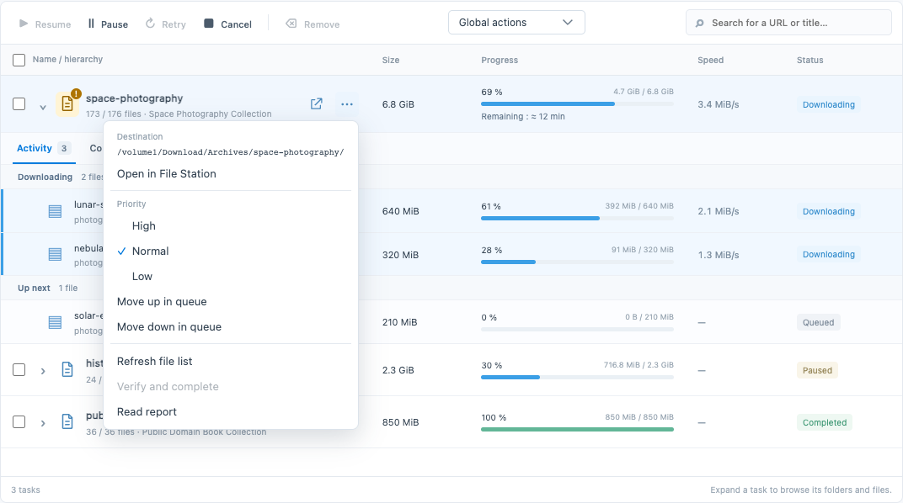
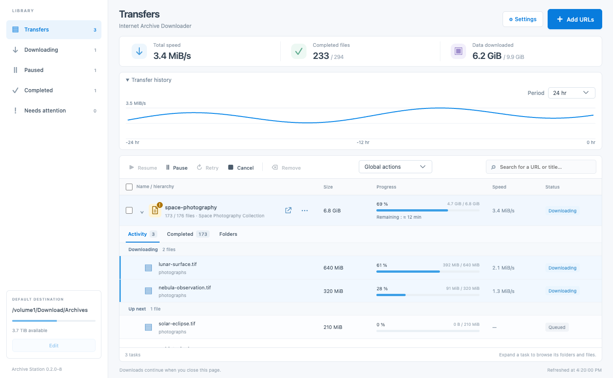

# Queue management and archive maintenance

These controls are available in **Settings** and in each task’s **⋯** menu, at the end of its row.

The toolbar acts on the selected archive or checked rows. The **⋯** menu always acts on its own archive, regardless of the toolbar selection. It stays open during progress updates; Escape closes it, and arrow keys move between its actions.

## Receive DSM desktop notifications

Receive alerts for task completion, persistent file errors and low disk space, even with the window closed. Disable them in Settings. Alerts go to DSM administrators and survive service restarts without duplicates.

## Schedule transfers

Choose weekdays and one daily time slot using the NAS clock; pause or apply an alternate speed limit outside it. Overnight slots belong to their starting day. Equal start/end times mean a full day. Manual pauses remain paused.

## Prioritize the queue

Set archive priority and move tasks within that priority. Star queued files to transfer them first within their archive. In-flight transfers finish normally.

## Protect free disk space

Keep a configurable reserve (1 GiB by default). The add dialog compares selected known sizes against free space minus the reserve and queued transfers on the same filesystem. Oversized tasks can be added paused. Low space during a transfer pauses the task; free space and resume it to continue. Unknown file sizes and external disk writes cannot be reserved in advance.

## Verify and complete an archive

Pause a task and wait for active transfers to stop, then recheck its files. Available checksums are always used for this operation, even if routine verification is disabled. Valid files are reused; missing or corrupt files are fetched again. Replaced copies are preserved under `.archive-station-replaced/<task-id>/<backup-id>/`, with their original relative paths. Without a checksum, only size can be verified.

## Control multiple tasks

Check archives or select all visible rows, then use the toolbar. Global actions pause all active tasks, resume paused tasks, or remove completed tasks while preserving their files. Search and filters clear hidden selections.

## Inspect recent throughput

Expand **Transfer history** and choose **1 h, 6 h, 12 h or 24 h** in **Period**. The 120 points average 30 seconds, 3 minutes, 6 minutes or 12 minutes, respectively. Hover for interval details. The browser remembers your choice. The NAS retains up to 24 hours of measurements independently of browser polling, checkpoints changed traffic every 30 seconds and saves at orderly shutdown. The graph survives package restarts and upgrades; forced termination can lose recent unsaved graph samples. Remaining-time estimates use their own five-minute average and warm up again after restarting.

## Refresh an archive

Fetch fresh metadata and review new or changed files before applying a selection to a stopped task. Initial exclusions stay excluded for new tasks; files absent from the source stay on disk. Changed files and obsolete partials are backed up before replacement. Metadata comparisons use available sizes/checksums; they cannot detect changes missing from the remote metadata.

## Open the destination in File Station

Choose **⋯ → Open in File Station** on an archive to open its folder inside DSM. If the item folder has not been created yet, its parent destination opens instead. The external-link icon beside **⋯** opens the archive's source page in a browser tab.

Pause and wait for active workers to stop before applying a metadata refresh or starting verification. Existing downloads and excluded files in older tasks remain intact during upgrades. For tasks created before file-selection tracking was introduced, refresh treats files absent from the saved task as new candidates.

## Read the report and error history

Click the document icon on an archive row, or **Read report** in its **⋯** menu, to read an up-to-date report inside Archive Station. The same report is written to `ArchiveStation-report-<task-id>.txt` in the archive folder. Long reports are paginated in the reader; the text file contains the entire history.

The icon turns amber when incidents have been recorded, including incidents that were later resolved. The history lists the affected file, first and last occurrence, count, latest attempt number, diagnostic message and resolution date. Repeated identical errors are grouped per file. A successful transfer resolves its recorded errors; retrying, restarting or repairing does not erase them. Low-space pauses are also recorded.

History starts when this feature is installed. An existing error can be imported without a known date, but errors already cleared by older versions cannot be recovered. The reader works even if the destination is temporarily unavailable; writing the disk copy still requires permission to that folder.

Reports are available in French when the interface is French, and in English for other languages. Automatic mode uses the last resolved DSM language with the same fallback. A language change updates the disk report at the next check, approximately every 15 seconds; use **Refresh** in an open reader. Recorded technical error messages retain their original text.
